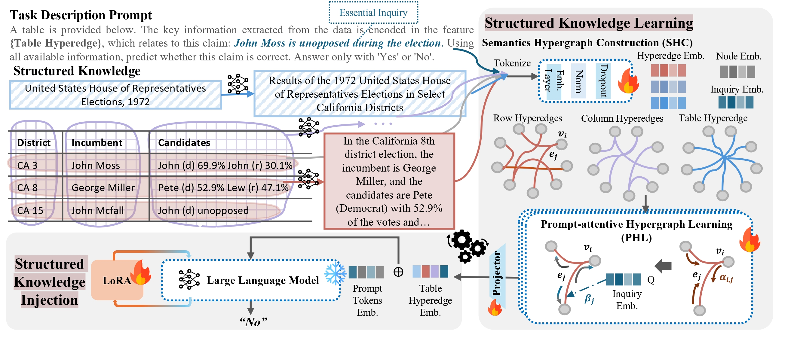

Hi!👋 My name is Hanqian Li(李翰乾). I am currently an M.Phil student** in the **AI Thrust, Information Hub** at the **Hong Kong University of Science and Technology (Guangzhou)**, supervised by [Prof. Xuming Hu](https://xuminghu.github.io/).  Previously, I received my **B.Eng. degree in Automation** from **Shandong University (SDU)**.I am honored to collaborate with [Dr. Aiwei Liu](https://exlaw.github.io/), [Dr. Sirui Huang](https://scholar.google.com.hk/citations?user=IL98pCsAAAAJ&hl=zh-CN), and [Dr. Jungang Li](https://openreview.net/profile?id=~Jungang_Li1) on research projects.

My research interests focus on **trustworthy large language models** and **multimodal video understanding**. Currently, I am focusing on topics such as text watermarking in LLMs and video watermarking, and I am conducting in-depth research in these areas.

## 🔥 News
- [2025.06] I have graduated from Shandong University, majoring in Automation Engineering.🎓
- [2025.04] A paper on enhancing LLMs for structured knowledge has been accepted at [SIGIR 2025](https://sigir2025.dei.unipd.it/).

## 📕 Publications

  

    

      
SIGIR'25

      
    

  

  

[**HyperG: Hypergraph-Enhanced LLMs for Structured Knowledge**](https://dl.acm.org/doi/pdf/10.1145/3726302.3730002)

<u>Sirui Huang†</u>, **<u>Hanqian Li†</u>**, Yanggan Gu, Xuming Hu, Qing Li, Guandong Xu

<strong></strong>

## 📖 Educations
- 2025.08 - present, M.Phil Student, HKUST(GZ)
- 2021.09 - 2025.06, Undergraduate Student, Shandong University

##  🖥️ Internship
- 2024.02 - 2025.06, Research Intern, HKUST(GZ)
